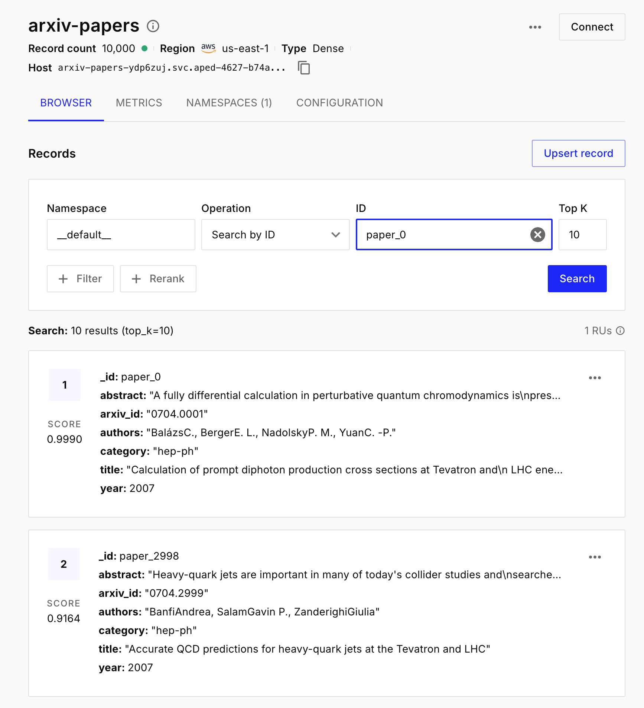

# HW 2

**Repo:** https://github.com/msselizabeth/sheremet_nosql_2

## Configuration

### 1. Environment Variables
    Create a `.env` file in the project root:

    ```env
    PINECONE_API_KEY=your_api_key_here
    ```

### 2. Docker Execution

Build and run the container in the background

    ```
    docker compose up -d --build

    # Access the container shell
    docker compose exec python_app bash
    
    ```

### 3. Pipeline Steps

    ```
    python scripts/01_prepare_data.py       # 1. Parse JSON and create Parquet subset
    python scripts/02_embed.py              # 2. Generate normalized embeddings (specter2_base)
    python scripts/03_load_to_pinecone.py   # 3. Create index and upsert batches to Pinecone
    python scripts/04_search.py             # 4. Semantic search and local metric calculations
    ```

## Part 1

#### Console Output 01_prepare_data.py

```
docker exec -it sheremet_nosql_2 python scripts/01_prepare_data.py

Читаємо датасет: 10000it [00:00, 178517.48it/s]
\nЗавантажено статей:10000
\nРозподіл за категоріями (топ-10):
category
astro-ph              1838
hep-th                 680
hep-ph                 671
quant-ph               564
gr-qc                  350
cond-mat.mes-hall      307
cond-mat.str-el        292
cond-mat.mtrl-sci      291
cond-mat.stat-mech     271
math.AG                209
Name: count, dtype: int64
\nРозподіл за роками:
year
2007    10000
Name: count, dtype: int64

\nПриклад запису:
{'id': '0704.0001', 'title': 'Calculation of prompt diphoton production cross sections at Tevatron and\n  LHC energies', 'abstract': 'A fully differential calculation in perturbative quantum chromodynamics is\npresented for the production of massive photon pairs at hadron colliders. All\nnext-to-leading order perturbative contributions from quark-antiquark,\ngluon-(anti)quark, and gluon-gluon subprocesses are included, as well as\nall-orders resummation of initial-state gluon radiation valid at\nnext-to-next-to-leading logarithmic accuracy. The region of phase space is\nspecified in which the calculation is most reliable. Good agreement is\ndemonstrated with data from the Fermilab Tevatron, and predictions are made for\nmore detailed tests with CDF and DO data. Predictions are shown for\ndistributions of diphoton pairs produced at the energy of the Large Hadron\nCollider (LHC). Distributions of the diphoton pairs from the decay of a Higgs\nboson are contrasted with those produced from QCD processes at the LHC, showing\nthat enhanced sensitivity to the signal can be obtained with judicious\nselection of events.', 'authors': 'BalázsC., BergerE. L., NadolskyP. M., YuanC. -P.', 'year': 2007, 'category': 'hep-ph'}

\nЗбережено вdata/arxiv_subset.parquet
```

#### Console Output 02_embed.py
```
docker exec -it sheremet_nosql_2 python scripts/02_embed.py

Batches: 100%|███████████████████████████████████████████████████████████████████████████████████████████████████████| 157/157 [09:26<00:00,  3.61s/it]

Total number of processed texts: 10000
The dimensions of the embeddings array: (10000, 768)
L2 norm of the first embedding: 1.0000
```

#### 1.2 Вибір інструментів

1. Чим Pinecone відрізняється від Qdrant і Chroma за моделлю розгортання, ліцензією і продуктивністю? У якому сценарії ви б обрали кожен із них?

- **Pinecone** — це SaaS-платформа, ідеальна для малого комерційного production або для автоматизації(як ми викоритсовуємо в поточній компанії). Ми зберігаємо попреднбо скорочені *support tickets* та шукаємо найбільш схожі за сенсом коли надходить новий—для пошуку інсайтів щодо root causes, або може були схожі кейси та зберегти час.
- **Qdrant** має відкритий код і підходить для *self-hosted* рішень, де потрібен повний контроль над даними, підвищена безпека та висока швидкість роботи. 
- **Chroma** — це найпростіша *in-memory* векторна база, яку раціонально обирати виключно для локальної розробки або швидкого прототипування(тестування ідей).

2. Чому для задачі пошуку по науковим текстам обрана модель `specter2_base`, а не універсальна `all-MiniLM-L6-v2`? Знайдіть картку моделі на HuggingFace і процитуйте, для яких задач вона навчена.

    Універсальні моделі навчаються на текстах загального призначення, а `specter2_base` створена спеціально для академічного контексту. Згідно з карткою моделі на HuggingFace, вона навчена для таких форматів задач: 
    - Classification
    - Regression
    - Proximity (Retrieval)
    - Adhoc Search
      
    *It builds on the work done in SciRepEval: A Multi-Format Benchmark for Scientific Document Representations and we evaluate the trained model on this benchmark as well.*

3. Що написано у картці моделі про рекомендовану метрику схожості? Чому це важливо при створенні індексу?

    Для моделей сімейства Sentence Transformers рекомендованою метрикою оцінки відстані є Cosine Similarity. Це критично важливо при створенні індексу в Pinecone: база даних повинна шукати найближчі вектори за тією ж математичною формулою, за якою модель оптимізували під час тренування, інакше результати пошуку будуть повністю нерелевантними.

#### 1.3 Отримання ембеддингів

Математично косинусна схожість між двома векторами $a$ та $b$ обчислюється як їхній скалярний добуток, поділений на добуток їхніх довжин:

$\text{Cosine Similarity} = \frac{a \cdot b}{||a|| ||b||}$

Нормалізація ембеддингів означає зведення векторів до одиничної довжини, тобто їхня норма стає рівною одиниці. Якщо підставити ці значення у формулу, знаменник перетворюється на одиницю, і рівняння скорочується:

$\text{Cosine Similarity} = \frac{a \cdot b}{1} = a \cdot b = \text{Dot Product}$

Тому для нормалізованих векторів ці дві метрики стають математично ідентичними. Вигідніше використовувати саме Dot Product для одиничних векторів, оскільки це економить обчислювальні ресурси бази даних на непотрібних операціях ділення.

## Part 2 

#### Console Output 03_load_to_pinecone.py
```
docker exec -it sheremet_nosql_2 python scripts/03_load_to_pinecone.py
100%|██████████████████████████████████████████████████████████████████████████████████████████████████████████████████| 50/50 [01:05<00:00,  1.31s/it]

Total vectors uploaded: 10000
```



## Part 3

#### Task 4 Аналіз результатів фільтрації:

При пошуку за запитом `"reinforcement learning"` результати кардинально відрізняються залежно від метаданих:

- Фільтр A ($>= 2019$, `cs.LG`): Видача фокусується на сучасних досягненнях у машинному навчанні, оскільки ми жорстко обмежили категорію `cs.LG` і взяли свіжі роки. Фільтр А не повернув результатів, оскільки з метою економії оперативної пам'яті датасет не перемішувався (читалися перші 10 000 рядків хронологічного файлу, що дало лише статті 2007-2008 років). Фільтр відпрацював коректно і відкинув нерелевантні дані.

- Фільтр B ($< 2015$): Видача показує фундаментальні, старіші підходи. Оскільки ми не обмежували категорію, пошуковик знайшов застосування концепцій навчання з підкріпленням у суміжних сферах: `physics.soc-ph`, `cs.MA`, які були популярні до буму глибокого навчання.

#### Console Output 04_search.py

```
docker exec -it sheremet_nosql_2 python scripts/04_search.py

-----------------------------------
Pure Semantic Search Results:
-----------------------------------
Top_1: Capturing knots in polymers
Year: 2007.0 | Category: cond-mat.soft
Abstract: This paper visualizes a knot reduction algorithm...

Top_2: Symbolic sensors : one solution to the numerical-symbolic interface
Year: 2007.0 | Category: physics.ins-det
Abstract: This paper introduces the concept of symbolic sensor as an extension of the
smart sensor one. Then, the links between th...

Top_3: The Mathematics
Year: 2007.0 | Category: math.HO
Abstract: This is an essay that considering the knowledge structure and language of a
different nature, attempts to build on an ex...

Top_4: Modeling the field of laser welding melt pool by RBFNN
Year: 2007.0 | Category: physics.comp-ph
Abstract: Efficient control of a laser welding process requires the reliable prediction
of process behavior. A statistical method ...

Top_5: Why should anyone care about computing with anyons?
Year: 2007.0 | Category: quant-ph
Abstract: In this article we present a pedagogical introduction of the main ideas and
recent advances in the area of topological q...


-----------------------------------
Filter A: >= 2019 AND cs.LG
-----------------------------------
No Results Found.

-----------------------------------
Filter B: < 2015
-----------------------------------
Top_1: Multi-Agent Modeling Using Intelligent Agents in the Game of Lerpa
Year: 2007.0 | Category: cs.MA
Abstract: Game theory has many limitations implicit in its application. By utilizing
multiagent modeling, it is possible to solve ...

Top_2: Introduction to Phase Transitions in Random Optimization Problems
Year: 2007.0 | Category: cond-mat.stat-mech
Abstract: Notes of the lectures delivered in Les Houches during the Summer School on
Complex Systems (July 2006)....

Top_3: Architecture for Pseudo Acausal Evolvable Embedded Systems
Year: 2007.0 | Category: cs.NE
Abstract: Advances in semiconductor technology are contributing to the increasing
complexity in the design of embedded systems. Ar...

Top_4: Why only few are so successful ?
Year: 2007.0 | Category: physics.pop-ph
Abstract: In many professons employees are rewarded according to their relative
performance. Corresponding economy can be modeled ...

Top_5: Opinion Dynamics and Sociophysics
Year: 2007.0 | Category: physics.soc-ph
Abstract: No abstract given. Contents:
  I. Definition and Introduction
  II. Schelling Model
  III. Opinion Dynamics
  IV. Langua...


-----------------------------------
Local Results: Top 5 Dot Product Results
-----------------------------------
Top_1: Capturing knots in polymers
Year: 2007 | Category: cond-mat.soft
Abstarct: This paper visualizes a knot reduction algorithm...

Top_2: Symbolic sensors : one solution to the numerical-symbolic interface
Year: 2007 | Category: physics.ins-det
Abstarct: This paper introduces the concept of symbolic sensor as an extension of the
smart sensor one. Then, the links between th...

Top_3: The Mathematics
Year: 2007 | Category: math.HO
Abstarct: This is an essay that considering the knowledge structure and language of a
different nature, attempts to build on an ex...

Top_4: Modeling the field of laser welding melt pool by RBFNN
Year: 2007 | Category: physics.comp-ph
Abstarct: Efficient control of a laser welding process requires the reliable prediction
of process behavior. A statistical method ...

Top_5: Python for Education: Computational Methods for Nonlinear Systems
Year: 2007 | Category: nlin.CD
Abstarct: We describe a novel, interdisciplinary, computational methods course that
uses Python and associated numerical and visua...


-----------------------------------
Local Results: Top 5 Cosine Results
-----------------------------------
Top_1: Capturing knots in polymers
Year: 2007 | Category: cond-mat.soft
Abstarct: This paper visualizes a knot reduction algorithm...

Top_2: Symbolic sensors : one solution to the numerical-symbolic interface
Year: 2007 | Category: physics.ins-det
Abstarct: This paper introduces the concept of symbolic sensor as an extension of the
smart sensor one. Then, the links between th...

Top_3: The Mathematics
Year: 2007 | Category: math.HO
Abstarct: This is an essay that considering the knowledge structure and language of a
different nature, attempts to build on an ex...

Top_4: Modeling the field of laser welding melt pool by RBFNN
Year: 2007 | Category: physics.comp-ph
Abstarct: Efficient control of a laser welding process requires the reliable prediction
of process behavior. A statistical method ...

Top_5: Python for Education: Computational Methods for Nonlinear Systems
Year: 2007 | Category: nlin.CD
Abstarct: We describe a novel, interdisciplinary, computational methods course that
uses Python and associated numerical and visua...


-----------------------------------
Local Results: Top 5 L2 Results
-----------------------------------
Top_1: Capturing knots in polymers
Year: 2007 | Category: cond-mat.soft
Abstarct: This paper visualizes a knot reduction algorithm...

Top_2: Symbolic sensors : one solution to the numerical-symbolic interface
Year: 2007 | Category: physics.ins-det
Abstarct: This paper introduces the concept of symbolic sensor as an extension of the
smart sensor one. Then, the links between th...

Top_3: The Mathematics
Year: 2007 | Category: math.HO
Abstarct: This is an essay that considering the knowledge structure and language of a
different nature, attempts to build on an ex...

Top_4: Modeling the field of laser welding melt pool by RBFNN
Year: 2007 | Category: physics.comp-ph
Abstarct: Efficient control of a laser welding process requires the reliable prediction
of process behavior. A statistical method ...

Top_5: Python for Education: Computational Methods for Nonlinear Systems
Year: 2007 | Category: nlin.CD
Abstarct: We describe a novel, interdisciplinary, computational methods course that
uses Python and associated numerical and visua...
```

#### Theoretical Questions:

1. *Чи збігаються топ-5 для cosine і dot product і чому?*

    Так, збігаються. Оскільки ембеддинги нормалізовані, знаменник у формулі косинусної схожості зникає(довжини нормалызованих векторыв = 1) => математично скорочується до скалярного добутку(dot product).
    
2. *Чи відрізняються результати для L2 і чому?*
    
    Топ-5 статей будуть ідентичними, але для L2 сортування йде за зростанням (шукаємо мінімум відстані). Для нормалізованих векторів ці метрики жорстко пов'язані: $L2^2 = 2 - 2 \times \text{Cosine}$. Тому мінімізація L2 дорівнює максимізації Cosine.

3. *Що сталося б, якби ембеддинги не були нормалізовані?*

    Топ-5 для кожної метрики був би різним. Dot Product залежав би від довжини вектора. Cosine ігнорував би довжину і рахував лише кут, а L2 вимірював би абсолютну відстань між точками.


### Part 4 Chunking

#### Console Output 05_chunking.py

```
docker exec -it sheremet_nosql_2 python scripts/05_chunking.py

Chunking (fixed): 100%|████████████████████████████████████████████████████████████████████████████████████████████████| 30/30 [00:03<00:00,  8.53it/s]
Upserting: 100%|█████████████████████████████████████████████████████████████████████████████████████████████████████████| 1/1 [00:01<00:00,  1.10s/it]
Chunking (semantic): 100%|█████████████████████████████████████████████████████████████████████████████████████████████| 30/30 [00:07<00:00,  3.90it/s]
Upserting: 100%|█████████████████████████████████████████████████████████████████████████████████████████████████████████| 1/1 [00:00<00:00,  1.11it/s]

--------------------------------------------------
Results from 'arxiv-chunks-fixed' for: 'deep neural networks architecture'
--------------------------------------------------
Top 1 | Paper: Absolute Calibration and Characterization of the Multiband Imaging
  Photometer for Spitzer. II. 70 micron Imaging | Chunk #3.0
Text: validates the MIPS 70 micron operating strategy, especially the use of frequent
stimulator flashes to track the changing responsivities of the Ge:Ga d...

Top 2 | Paper: Is Modified Gravity Required by Observations? An Empirical Consistency
  Test of Dark Energy Models | Chunk #3.0
Text: data already. We find w(grow) < -0.80 at 2 sigma. As an example, the best-fit
flat Dvali-Gabadadze-Porrati (DGP) model approximated by our parametriza...

Top 3 | Paper: Improved constraints on dark energy from Chandra X-ray observations of
  the largest relaxed galaxy clusters | Chunk #3.0
Text: constant paradigm. Our analysis includes conservative allowances for systematic
uncertainties. The small systematic scatter and tight constraints bode...

Top 4 | Paper: Multicolor observations of the afterglow of the short/hard GRB 050724 | Chunk #3.0
Text: compelling case for association between a short burst and a galaxy with old
stellar population. It thus plays a pivotal role in constraining progenito...

Top 5 | Paper: Dependence of CMI Growth Rates on Electron Velocity Distributions and
  Perturbation by Solitary Waves | Chunk #3.0
Text: result in a gain enhancement more than 40 dB depending on the convective growth
length within the structure. Similar enhancements may be caused by EMI...


--------------------------------------------------
Results from 'arxiv-chunks-semantic' for: 'deep neural networks architecture'
--------------------------------------------------
Top 1 | Paper: The Kinematics of the Ultra-Faint Milky Way Satellites: Solving the
  Missing Satellite Problem | Chunk #1.0
Text: [slightly abridged]....

Top 2 | Paper: Spin Effects in Quantum Chromodynamics and Recurrence Lattices with
  Multi-Site Exchanges | Chunk #0.0
Text: In this thesis, we consider some spin effects in QCD and recurrence lattices with multi-site exchanges. Main topic of our manuscript are critical phen...

Top 3 | Paper: The Boundary Conditions of the Heliosphere: Photoionization Models
  Constrained by Interstellar and In Situ Data | Chunk #1.0
Text: 23 - 0. 27 cm^-3, T = 6300 K, X(H^+) ~ 0. 2, and X(He^+) ~ 0. 4. These results appear to be robust since acceptable models are found for substantially...

Top 4 | Paper: Multicolor observations of the afterglow of the short/hard GRB 050724 | Chunk #0.0
Text: New information on short/hard gamma-ray bursts (GRBs) is being gathered thanks to the discovery of their optical and X-ray afterglows. However, some k...

Top 5 | Paper: A model for the Globular Cluster extreme anomalies | Chunk #0.0
Text: In spite of the efforts made in the latest years, still there is no comprehensive explanation for the chemical anomalies of globular cluster stars. Am...


--------------------------------------------------
Results from 'arxiv-chunks-fixed' for: 'statistical mechanics and algorithms'
--------------------------------------------------
Top 1 | Paper: Spin Effects in Quantum Chromodynamics and Recurrence Lattices with
  Multi-Site Exchanges | Chunk #0.0
Text: In this thesis, we consider some spin effects in QCD and recurrence lattices
with multi-site exchanges. Main topic of our manuscript are critical phen...

Top 2 | Paper: Improved constraints on dark energy from Chandra X-ray observations of
  the largest relaxed galaxy clusters | Chunk #3.0
Text: constant paradigm. Our analysis includes conservative allowances for systematic
uncertainties. The small systematic scatter and tight constraints bode...

Top 3 | Paper: Absolute Calibration and Characterization of the Multiband Imaging
  Photometer for Spitzer. II. 70 micron Imaging | Chunk #3.0
Text: validates the MIPS 70 micron operating strategy, especially the use of frequent
stimulator flashes to track the changing responsivities of the Ge:Ga d...

Top 4 | Paper: Is Modified Gravity Required by Observations? An Empirical Consistency
  Test of Dark Energy Models | Chunk #3.0
Text: data already. We find w(grow) < -0.80 at 2 sigma. As an example, the best-fit
flat Dvali-Gabadadze-Porrati (DGP) model approximated by our parametriza...

Top 5 | Paper: The Origin of the Galaxy Mass-Metallicity Relation and Implications for
  Galactic Outflows | Chunk #3.0
Text: reflects the mass scale where MLF~1, rather than a characteristic wind speed.
The tight observed MZR scatter is ensured when t_d<1 dynamical time, whi...


--------------------------------------------------
Results from 'arxiv-chunks-semantic' for: 'statistical mechanics and algorithms'
--------------------------------------------------
Top 1 | Paper: The Kinematics of the Ultra-Faint Milky Way Satellites: Solving the
  Missing Satellite Problem | Chunk #1.0
Text: [slightly abridged]....

Top 2 | Paper: Spin Effects in Quantum Chromodynamics and Recurrence Lattices with
  Multi-Site Exchanges | Chunk #0.0
Text: In this thesis, we consider some spin effects in QCD and recurrence lattices with multi-site exchanges. Main topic of our manuscript are critical phen...

Top 3 | Paper: The Boundary Conditions of the Heliosphere: Photoionization Models
  Constrained by Interstellar and In Situ Data | Chunk #1.0
Text: 23 - 0. 27 cm^-3, T = 6300 K, X(H^+) ~ 0. 2, and X(He^+) ~ 0. 4. These results appear to be robust since acceptable models are found for substantially...

Top 4 | Paper: Multicolor observations of the afterglow of the short/hard GRB 050724 | Chunk #0.0
Text: New information on short/hard gamma-ray bursts (GRBs) is being gathered thanks to the discovery of their optical and X-ray afterglows. However, some k...

Top 5 | Paper: High energy afterglows and flares from Gamma-Ray Burst by Inverse
  Compton emission | Chunk #0.0
Text: We perform a detailed study of inverse Compton (IC) emission for a fireball undergoing external shock (ES) in either a uniform or a wind-like interste...

```

#### Theoretical Questions

*1. Яка стратегія дає більш осмислені чанки?*

Більш грунтовні результати дає **Semantic chunking**. Fixed-size нарізає текст *"наосліп"* за кількістю слів, що часто призводить до обриву логіки. Семантичний підхід розбиває текст на рівні цілих речень і об'єднує їх лише доти, поки вони зберігають високу косинусну схожість. Це гарантує, що один чанк містить одну завершену думку.

*2. Чи є випадки розрізаних речень і як це впливає на ембеддинги?*

При використанні `Fixed-size chunking` розрізані речення трапляються регулярно. Це критично погіршує якість ембеддингів: якщо алгоритм розділить складний термін навпіл, модель згенерує два окремих вектори, жоден з яких не міститиме повного змісту. В результаті такий чанк може просто не знайтися за релевантним запитом. У `Semantic chunking` таких випадків немає, оскільки спліттер базується на розділових знаках.

*3. Як розмір overlap впливає на кількість чанків і покриття тексту?*

Чим більший `overlap`, тим менший крок зсуву вікна (sliding window), відповідно, **більша загальна кількість чанків**, що збільшує витрати на зберігання у векторній БД. Проте великий overlap покращує покриття тексту: він гарантує, що важливий контекст, який знаходиться на межі двох фрагментів, не буде втрачено, і LLM отримає цілісну картину для формування відповіді.


### Part 5 Hybrd Search

#### Console Output 06_hybrid_search.py

**Evaluating query: 'BERT fine-tuning'**

| *Rank* | *BM25* | *Pinecone* | *RRF* |
| ----- | ----- | ----- | ----- |
| 1 | The NMSSM Solution to the Fine-Tuning Problem, Precision Electroweak Constraints and the Largest LEP Higgs Event Excess | Misere quotients for impartial games: Supplementary material | The NMSSM Solution to the Fine-Tuning Problem, Precision Electroweak Constraints and the Largest LEP Higgs Event Excess *(Score: 0.0164)* |
| 2 | Fine-Tuning in Brane-antibrane Inflation | Introduction to Phase Transitions in Random Optimization Problems | Misere quotients for impartial games: Supplementary material *(Score: 0.0164)* |
| 3 | Conformal dynamics in gauge theories via non-perturbative renormalization group | Abstract Convexity and Cone-Vexing Abstractions | Fine-Tuning in Brane-antibrane Inflation *(Score: 0.0161)* |
| 4 | Inverse Monte-Carlo determination of effective lattice models for SU(3) Yang-Mills theory at finite temperature | The Compositions of the Differential Operations and Gateaux Directional Derivative | Introduction to Phase Transitions in Random Optimization Problems *(Score: 0.0161)* |
| 5 | Eternal Inflation is "Expensive" | Experimental local realism tests without fair sampling assumption | Conformal dynamics in gauge theories via non-perturbative renormalization group *(Score: 0.0159)* |

**Evaluating query: 'Yann LeCun convolutional networks'**

| *Rank* | *BM25* | *Pinecone* | *RRF* |
| ----- | ----- | ----- | ----- |
| 1 | On Punctured Pragmatic Space-Time Codes in Block Fading Channel | Multilayer Perceptron with Functional Inputs: an Inverse Regression Approach | Optimization in Gradient Networks *(Score: 0.0303)* |
| 2 | Trellis-Coded Quantization Based on Maximum-Hamming-Distance Binary Codes | The Netsukuku network topology | On Punctured Pragmatic Space-Time Codes in Block Fading Channel *(Score: 0.0164)* |
| 3 | Response of degree-correlated scale-free networks to stimuli | The Compositions of the Differential Operations and Gateaux Directional Derivative | Multilayer Perceptron with Functional Inputs: an Inverse Regression Approach *(Score: 0.0164)* |
| 4 | Numerical evaluation of the upper critical dimension of percolation in scale-free networks | Modeling the field of laser welding melt pool by RBFNN | Trellis-Coded Quantization Based on Maximum-Hamming-Distance Binary Codes *(Score: 0.0161)* |
| 5 | On Automorphism Groups of Networks | Adaptive classification of temporal signals in fixed-weights recurrent neural networks: an existence proof | The Netsukuku network topology *(Score: 0.0161)* |

**Evaluating query: 'making computers understand human emotions from text'**

| *Rank* | *BM25* | *Pinecone* | *RRF* |
| ----- | ----- | ----- | ----- |
| 1 | An Automated Evaluation Metric for Chinese Text Entry | Opinion Dynamics and Sociophysics | On the Development of Text Input Method - Lessons Learned *(Score: 0.0323)* |
| 2 | On the Development of Text Input Method - Lessons Learned | On the Development of Text Input Method - Lessons Learned | An Automated Evaluation Metric for Chinese Text Entry *(Score: 0.0164)* |
| 3 | Towards Understanding the Origin of Genetic Languages | Extracting the hierarchical organization of complex systems | Opinion Dynamics and Sociophysics *(Score: 0.0164)* |
| 4 | Detecting anchoring in financial markets | Novelty and Collective Attention | Towards Understanding the Origin of Genetic Languages *(Score: 0.0159)* |
| 5 | Database Manipulation on Quantum Computers | Narratives within immersive technologies | Extracting the hierarchical organization of complex systems *(Score: 0.0159)* |


#### Theoretical Questions

*1. Який метод дав кращий результат і чому?*

  Найкращий та найбільш збалансований результат дав гібридний пошук (RRF).Лексичний BM25 занадто буквально чіпляється за слова (наприклад, у запиті "BERT fine-tuning" він знайшов статті з фізики про "fine-tuning problem", проігнорувавши контекст машинного навчання). Векторний пошук краще вловлює контекст (наприклад, знайшов "Multilayer Perceptron" за запитом 'Yann LeCun convolutional networks'), але може відлітати в абстракції. Гібридний підхід компенсує недоліки обох: він піднімає в топ ті документи, які мають і точний збіг ключових слів, і високу семантичну спорідненість із запитом.

*2. Чи є документи в топ-5 гібридного пошуку, яких немає в топ-5 окремих методів, і чому?*

  Так, це чітко видно у другому запиті—"Yann LeCun convolutional networks". Документ "Optimization in Gradient Networks" посів 1 місце в гібридній видачі, хоча його немає в топ-5 ані лексичного, ані векторного пошуку.Це відбувається через математику RRF: документ, який посідає, наприклад, 6-те місце в обох списках, отримає більшу суму балів ніж документ, який був на 1-му місці в BM25, але на якомусь 100-му місці у векторній видачі. 

*3. Як зміна параметра k в RRF впливає на видачу (наприклад, k=60 vs k=1)?*

  Параметр $k$ відповідає за згладжування рангів. При $k=60$ різниця в балах між 1-м і 2-м місцями дуже мала. Перемагають документи, які є високо в обох списках. Якщо поставити $k=1$, різниця стане колосальною: 1-ше місце отримає $0.5$ бала, а 2-ге — $0.33$. У такому разі документ-лідер з одного списку майже завжди перебиватиме результати іншого, і гібридний пошук фактично видасть дуже високий скор при цьому втративши сенс.

## Part 6

